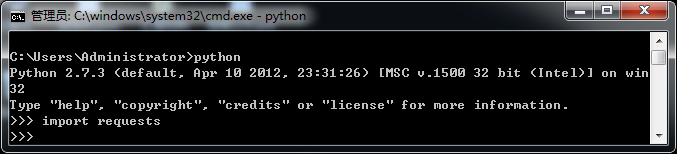
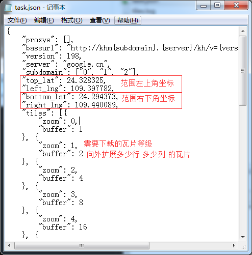

## 瓦片下载和地图制作工具 ##

# 使用方法: 

### 1. 运行环境搭建

> 需要安装 python 2.x 环境
> 需要安装 requests 依赖包 (安装方法: easy_install requests)



### 2. 参数配置

> task.json 参数文件包含 要下载的地图范围 以及需要下载的地图等级

> top_lat/left_lng 范围左上角坐标

> bottom_lat/right_lng 范围右下角坐标

> zoom 需要下载的等级

> buffer 该等级瓦片向外扩充多少行列瓦片

> 其他参数原计划是有用的，后来就懒得处理了



### 3. 源码修改

> 在源码中需要注意的几个地方

> 1. proxies 代理服务器 如果需要下载的网址不能直接访问 可以使用 proxies 参数

```python
proxies = {
  #'http': 'http://127.0.0.1:8080'
  #'http': 'socks5://127.0.0.1:1080'
}
```

> 2. 设置连接超时

```python
socket.setdefaulttimeout(20)    # 20秒超时
```

> 3. 设置最大线程数、输出目录、任务文件、输出地图名

```python
maxThreads = 16                         # 最大线程数 设置到 100 都没问题 只要带宽够
outpath = './out/'                      # 数据输出目录
jsonfile = 'task.json'                  # 任务文件
mapname = 'MAP'                         # 输出的地图名称
```

> 4. 在 Spider 类的初始化函数里可以设置数据下载地址 非常重要

```python
self.TILES_URL = 'http://mt1.google.cn/vt/lyrs=s&hl=en&x={0}&y={1}&z={2}'   # 谷歌地图无偏移影像地址
```

> 5. 在 DownloadTiles 函数里 设置文件保存规则 默认规则为 ESRI 标准切片目录结构 以及存储文件的扩展名

```python
savefile = '%s/L%02d/R%08x/C%08x.JPG' % (self.outpath, zoom, y, x)
```

###

###

## 微信打赏٩(๑❛ᴗ❛๑)۶


#### 关键字: 影像下载 瓦片下载 谷歌影像 百度影像 百度瓦片 Tile TileDownload 最快的影像下载工具
